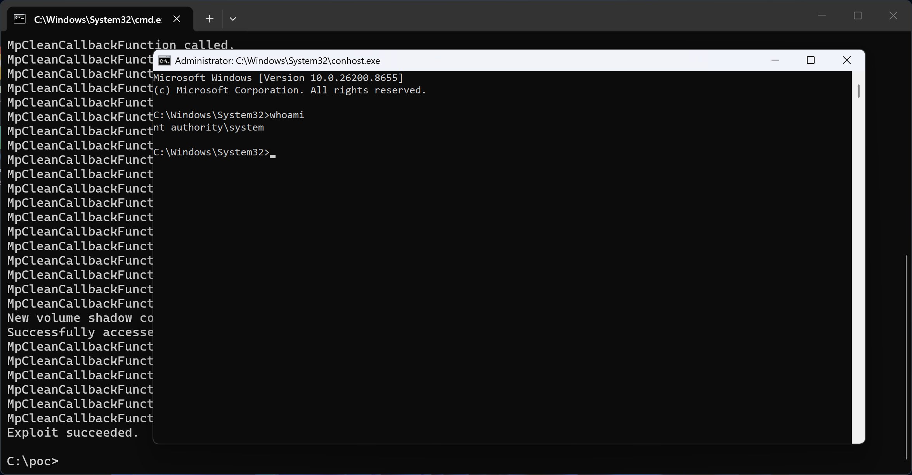

# RoguePlanet

RoguePlanet Windows Defender Vulnerability

Welcome back everyone !!!

The exploit is a race condition, so it's a hit or miss. I have managed to get a 100% success rate on some machines while it struggled to work on others.

The exploit has been tested in Windows 11 (Official channel + Canary) and Windows 10 with june 2026 patch installed. The PoC however does not work in Windows Server since standard users cannot mount an ISO image, I'm confident that all Windows Server versions are vulnerable as well but by the time I figured out it that the PoC doesn't work in Windows Server installations, it was a too late to redesign the exploit to overcome this issue. But I want to make one thing very clear. All Windows Server installations are vulnerable as well, you just need to redesign the exploit.

The race condition part is a bit interesting, I believe (but not sure) that a redesign of the PoC can make it achieve a 100% success rate regardless of the conditions but honestly I'm done with this bug.

If the exploit succeeds, a SYSTEM shell will be spawned

